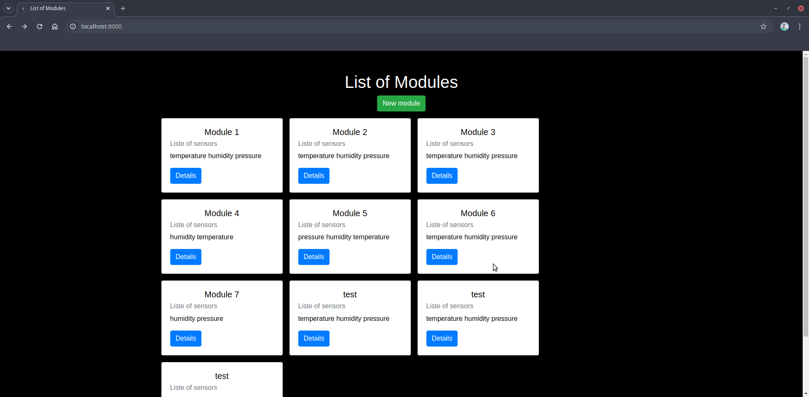
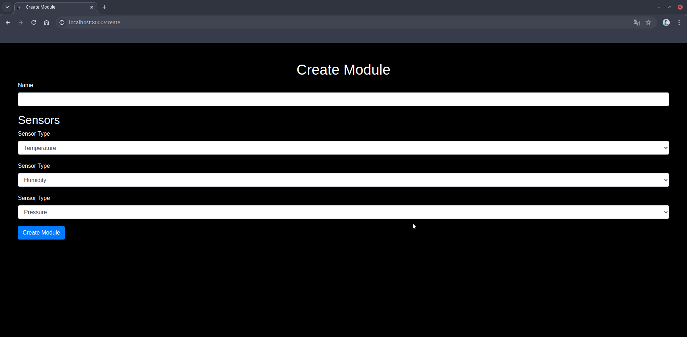
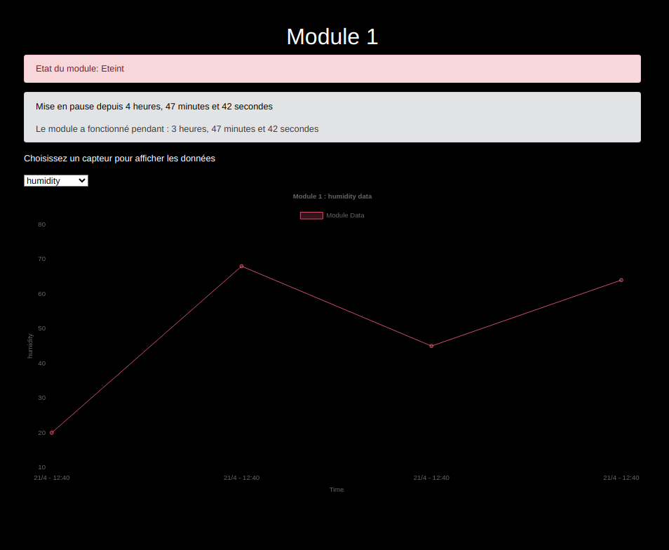

# Test We Breathe

## Introduction

Ce projet a pour but d'afficher des modules qui contiennent des capteurs enregistrant différentes mesures.

### Prérequis

- PHP 8
- Symfony 7+
- Mysql (MariaDB V 10.11.7)
- Composer 2.5.5

### Installation du projet

#### Etape 1

- Vérifier les prérequis.
- Copier/coller le fichier `.env.example` dans un `.env` et ajouter la connexion à la base de données.

### Etape 2

A la racine du projet suivre les étapes suivantes :

- Installer les dépendances via `composer install`.
- Créer la base de donnée avec la commande symfony `bin/console doctrine:database:create`.
- Lancer les migrations pour insérer les tables dans la base de données avec la commande symfony `bin/console doctrine:migrations:migrate`.
- Lancer un serveur php à l'aide de la commande `php -S localhost:8000 -t public`.

### Etape 3

Pour insérer les données vous pouvez le faire de trois façons :

#### 1.Fixtures

- Lancer la commande `bin/console doctrine:fixtures:load` pour créer les données initiales.

#### 2.Commandes manuelles

- Se connecter à la page localhost:8000.
- Créer un nouveau module avec les capteurs associés.
- Utiliser la commande `bin/console app:generate-module-status` pour générer aléatoirement le status du module.
- Utiliser la commande `bin/console app:generate-measurement` pour générer des mesures aléatoires.

#### 3.Automatisation avec cron

Dans la racine de votre projet

- Lancer la commande `crontab -e`
- Ajouter dans le fichier la commande à executer par exemple `* * * * * php /chemin/vers/votre/projet/app/console app:generate-measurement`.
- Une fois la commande lancée des mesures seront générées toutes les minutes.
- Vous pouvez modifier ce délai en remplaçant les étoiles par des chiffres : `5 * * * * php /chemin/vers/votre/projet/app/console app:generate-measurement` : cette commande se lancera toutes les 5 minutes.
- Vous pouvez faire la même chose avec la génération du status des modules à l'aide de la commande `* * * * * php /chemin/vers/votre/projet/app/console app:generate-module-status`.
- Quitter le fichier de cron avec la commande ctrl+x.
- Pour supprimer le cron il faut retourner dans le fichier toujours à l'aide de la commande `crontab -e` et supprimer les lignes que vous avez ajouté précédemment.

### Captures d'écrans

